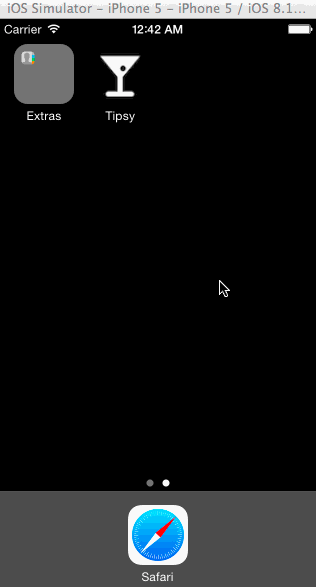

# Tip Calculator prework assignment

This is an iOS Swift Application for calculating 18%, 20%, and 22% tips for a given bill amount.  The demo is based on the step-by-step video setup of the basic application [Tip Calculator in Swift](http://vimeo.com/102084767) which is then augmented with a navigation bar, Setting ViewController, Lifecycle functionality, and several optional tasks.

Time spent: 6 hours spent in total

Completed user stories:

 * [x] Required: Create the default Tip Calculator as explained in the video.
 * [x] Required: Add a navigation bar with a link to the settings ViewController
 * [x] Required: Set defaults in the settings page with return link to the main ViewController
 * [x] Required: add ViewController Lifecycle that remembers default settings after returning to tip ViewController
 * [x] Optional: Remember the bill amount across app restarts.  Clear the state after 10 minutes to null amount.
 * [x] Optional: Add a light/dark color theme to settings view (4 colors)
 * [x] Optional: Add currency thousands separators (commas)
 
 
Notes:

The application is setup to run on the iPhone 5 / iOS 8.1 as suggested in the video.

Walkthrough of all user stories:

GIF created with [LiceCap](http://www.cockos.com/licecap/).
